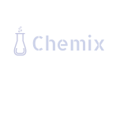
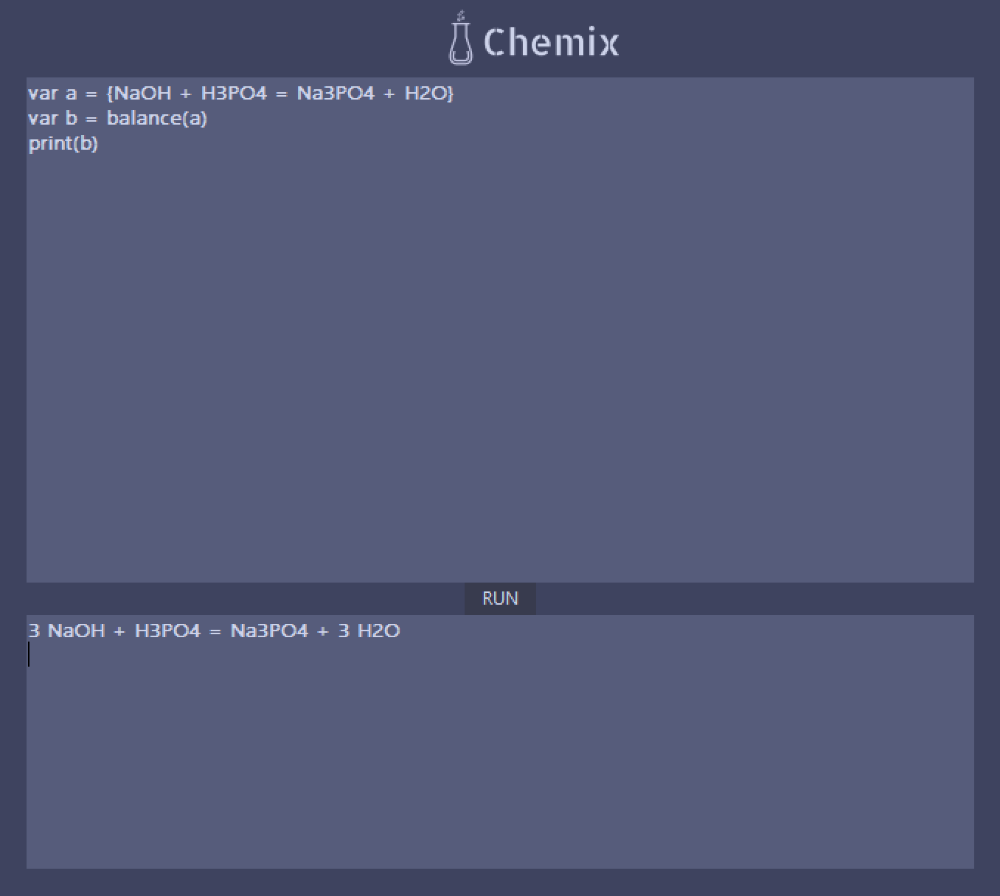

# Chemix


Chemix is a DSL for Chemistry. Its main functionality is to balance chemical equations.

## Usage
Example of Input:
```
var a = {NaOH + H3PO4 = Na3PO4 + H2O}
var b = balance(a)
print(b)
```
Example of Output:
```
3 NaOH + H3PO4 = Na3PO4 + 3 H2O
```


## Contributing
This is a semestrial project developed within the Technical University of Moldova at Elaboration of Field Specific Languages
### Team:
- Volcov Oleg
- Andronovici Darinela
- Mamaliga Dumitras
- Corman Daniel
- Trofim Iuliana
